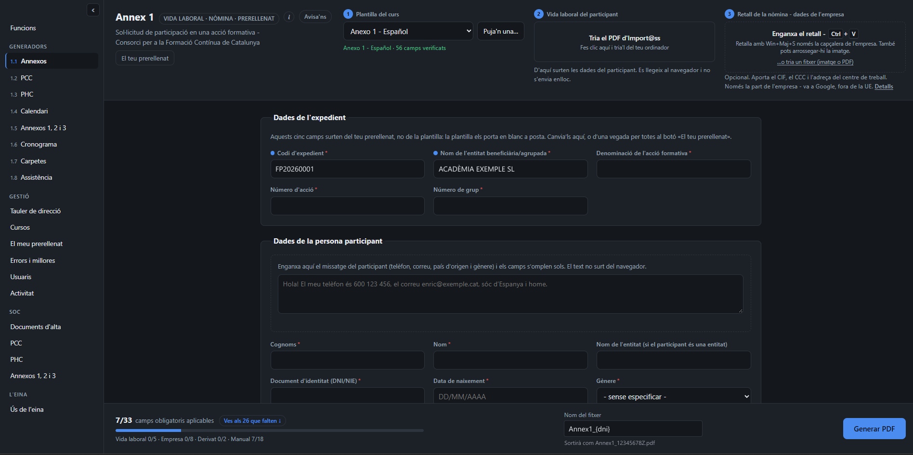
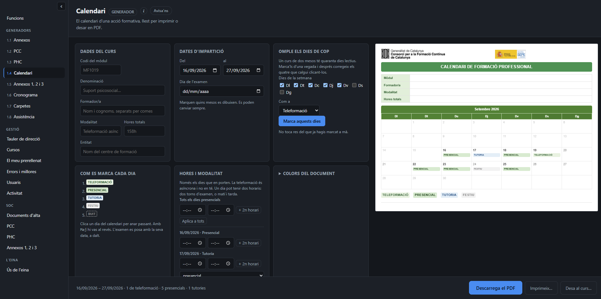
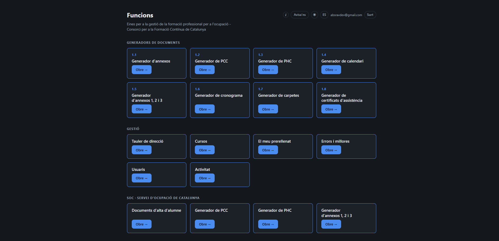
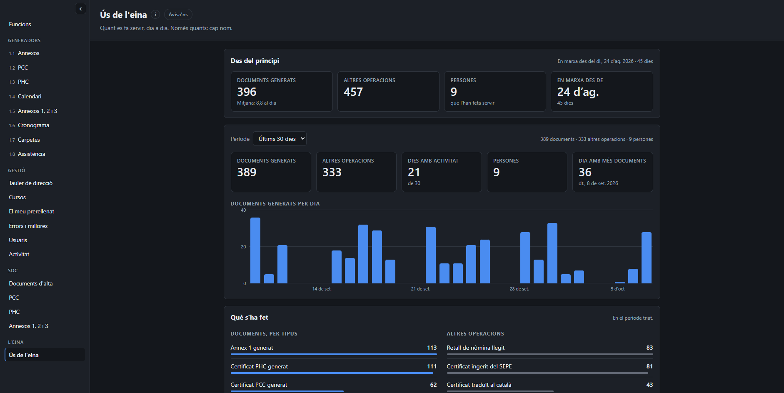

# 📑 SFP Tool

> An internal web suite that automates the paperwork of subsidised vocational training courses in Catalonia: application forms, certificates, course calendars, activity schedules, teaching plans, enrolment documents and grades. I proposed it, designed it and built it end to end, from the PDF filling in the browser to the API, the database, the login and the AI pipeline. The staff of the training centre where I work use it every day. **Source and tool kept private.**

  

  

  
  

## The problem

Every student on a subsidised course generates a stack of paper: the official application form, key-competence certificates, attendance certificates, enrolment documents, the teaching plan for each module, the course calendar, the schedule of graded activities, the index of the course folder, the grades. Two public bodies, each with its own forms, in two languages.

All of it was done by hand. Data was copied field by field between the CRM, the PDFs each student brings (their Social Security employment record, a payslip) and the official forms, one student at a time. Slow, error-prone, and an error in an official document doesn't announce itself: it gets filed and submitted.

I work in administration, not as a developer, and nobody asked for software. I saw the bottleneck, proposed a tool, built the first piece, and it grew from there into a suite with roles, courses, grades and a management dashboard.

## What it does

Nine document generators plus the course management around them, each on its own page.

### The application form: read, cross-check, fill

The flagship. The official form is a PDF with a 57-field AcroForm (typos in the field names included) published in Spanish and Catalan, with different field names and translated dropdown values in each.

- **The employment record is parsed 100% in the browser.** Name, ID, date of birth, Social Security number, contribution group: extracted from the PDF with pdf.js and never sent anywhere. The contribution group derives the professional category using the rule printed in the form itself.
- **The employer's data comes from a screenshot of the payslip header**, pasted with Ctrl+V and read by a multimodal model. Only the company block is sent, never the whole payslip.
- **Every field gets a traffic light.** Green: extracted and verified (check digit passes, confirmed by a second document). Amber: inferred, or read by AI and pending review. Red: not found. Blue: comes from the user's own prefill profile. **Nothing read by AI is ever green** unless the other document confirms it.
- **The output PDF stays editable.** The form is filled, never flattened, so staff can correct by hand before printing.
- A progress counter that only counts fields that actually apply (if the student is unemployed, the 8 employer fields leave the denominator), and a button that jumps to the next missing field, top to bottom.

### Documents that are the screen

For the calendar, schedule, certificates and folder index there's no "generate" button. **The document is drawn on screen and that's what gets printed.** Days are marked by clicking the calendar itself. A second button downloads a real PDF drawn with pdf-lib from the same data, same labels and same colour palette, so preview and file can't drift apart in content.

### Teaching plans from the official spec

Each vocational certificate has an official specification (learning outcomes, assessment criteria, contents, spaces) published as a PDF by the national employment service at a fixed URL per code. The worker downloads it, an AI transcribes it into a closed schema in two passes (skeleton, then one module at a time), **a person reviews it on screen** and saves it for the whole team. From then on, the three-annex `.docx` is generated in the browser by opening the official Word template and rewriting only its tables, cell by cell, so styles, footnotes and layout survive byte for byte.

An optional Catalan translation goes through the same review, and is rejected automatically if its structure (codes, hours, counts of outcomes and criteria) doesn't match the original.

### Courses, grades and the people around them

- **Roles per page**: creator, staff, management, teachers, and "pending" for anyone who just logged in. Enforced server-side for every page and every API route; the UI only hides.
- **Courses** with their teachers, dates, exam shifts and documents stored in R2, saved straight from any generator with one click.
- **Grades**: teachers enter them in a fast keyboard-driven panel (one activity, all students; ±0.25 steps), weighted exactly like the centre's spreadsheet template, exported to an `.xlsx` with real formulas written by hand (no spreadsheet library) or to a PDF summary.
- **Management dashboard**: participants, employment status and pass rate per course, with course status derived from dates. **Not a single student name crosses the wire**: the query doesn't select it, the types don't have it, the response is built key by key.
- **Usage page**: how much the tool is used, day by day, without saying who.
- Catalan and Spanish interface, light and dark theme, and a feedback button on every page for bug reports.

## Design decisions I care about

**Privacy by construction, not by promise.** Personal data of students is processed in the browser. What goes to the AI is a crop with the *employer's* data, and the model's output schema has no field where an ID number or a name could fit; the server copies the response key by key, and a downstream mapper only produces company fields. Three code barriers behind the prompt, with tests that feed a deliberately disobedient model response and check nothing personal reaches the form. When the project later needed to store student names (for grades), it was an explicit decision with its own narrow schema: name only, no column for anything else.

**The AI reads; it never decides.** Check digits, cross-document validation, the traffic light and the form filling are deterministic and tested. The model is a source, not an authority.

**Fail closed.** The worker verifies the Cloudflare Access JWT on every request (RS256 only, audience, issuer, expiry, key rotation) instead of trusting dashboard configuration. With no configuration, the API answers 503. This exists because the dashboard once said the app was protected and it wasn't. Every feature that sends data to a third party has its own explicit kill switch, off by default.

**The privacy notice tells the truth.** Which AI endpoint is used depends on which credential is set (a regional EU endpoint, or a global one), and the notice shown to users is built from the server's actual configuration, not hard-coded. A notice that promises more than the code does is worse than none.

**Configuration as data.** Official field names, their typos and their translations live in JSON, validated against the loaded PDF at startup. When a new call for applications changed some dropdown values, a test said which ones by name instead of leaving a dropdown silently empty.

**Resilience against the AI provider.** If a model is retired or overloaded, the worker moves through a catalogue of fallbacks, telling "doesn't exist" (permanent) apart from "busy" (this request only). It happened: a whole model generation was retired for new accounts overnight, and the tool kept working.

**Business logic outside the UI.** Every rule (dates in UTC strings to survive DST, Windows-safe file names, grade weighting, which marks go in which schedule column) lives in pure modules with tests. The UI files read fields, paint and listen; they contain no rules.

## Built with

- **TypeScript** on both sides, vanilla DOM, no UI framework
- **Cloudflare Workers** with static assets, serving every page through role checks
- **Cloudflare Access** (Zero Trust, one-time PIN) with JWT verification in the worker
- **Neon** (serverless Postgres) for profiles, courses, grades and the audit log
- **Cloudflare R2** for course documents, always served through the worker, never by URL
- **pdf.js** to read PDFs and **pdf-lib** to fill AcroForms and draw new PDFs, both in the browser
- **JSZip** to rewrite official `.docx` templates and write `.xlsx` files by hand, lazy-loaded
- **Gemini** over plain REST, no SDK; OAuth2 for Vertex AI signed with WebCrypto, since the Google auth library doesn't run on Workers
- **esbuild** and Node's built-in test runner

## Why there's no source or demo here

The tool runs on real data of real people, and it's built around the centre's internal templates and processes. That doesn't belong in public, and a public demo would mean redrawing official forms under a fake identity, which I'd rather not do. Happy to walk through it live in an interview.

## What I'd still do differently

- **The PDF layout lives twice**, in CSS for the screen and in coordinates for pdf-lib. I narrowed the duplication to pure geometry (content and colours have one source), but a single layout engine would remove it.
- **The course model is split.** The generators keep the course in the browser and the server keeps another course record in Postgres. They don't contradict each other today, but they should be one thing.
- **Layout has no automated check.** Tests verify every cell and every string, and that the files reopen; whether a `.docx` looks right is still checked by opening it in Word.
- **The Spanish interface is a runtime dictionary** over the Catalan DOM. It kept the pages single-sourced, but a new string doesn't warn that its translation is missing.

## AI assistance

Parts of this project and this write-up were built with AI assistance, disclosed here as in all my repos.

---

<em>If you want to talk about how it's built, reach out.</em>

  

<a href="mailto:absravdev@gmail.com">📧 absravdev@gmail.com</a> · <a href="https://abstractraven.com/">🌐 abstractraven.com</a> · 🐦‍⬛ <a href="https://github.com/absravdev">AbstractRaven</a>

